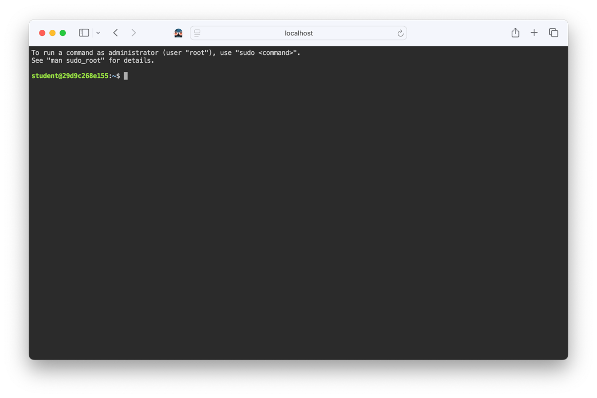
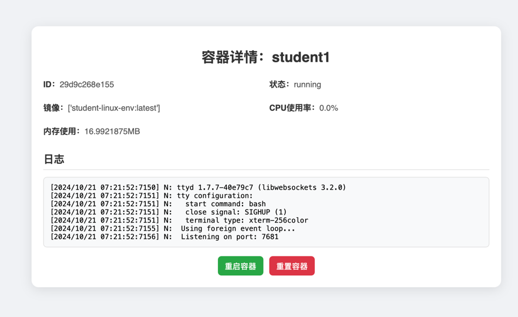

# EduLinux
为学生提供基于 Docker 容器的虚拟 Linux 实验环境

## 部署
### 部署docker容器
1. 安装 Docker以及 Docker Compose（需要使用V2版本）
2. 克隆本项目，切换工作目录`Docker_config`
3. 使用dockerfile 编译镜像`student-linux-env`
```bash
docker build -t student-linux-env .
```
4. 使用docker-compose 启动容器
```bash
docker compose up
```

### 部署管理界面
1. 切换到目录`Docker_manage`
2. pip安装依赖
```bash
pip install -r requirements.txt
```
3. 运行管理界面
```bash
python manage.py runserver localhost:8000 
```

## 学生使用
访问`http://localhost/student1` ，sudo用户名`student`，密码`student_password`

这个是学生1的环境，其他学生的环境分别是`http://localhost/student2` ，`http://localhost/student3`  以此类推

## 文件管理
`./volume/share` 是共享文件夹，映射到容器的`/home/student/share`，这个目录可以作为发布实验文件用，所有容器都可以访问，并且学生在容器内是只读的

`./volume/student/1` 是学生1的文件夹，映射到容器的`/home/student/1`，这个目录是学生1的私人文件夹，其他学生无法访问，学生可以在这个目录下进行实验

## 管理容器
访问`http://localhost/student1/manage` ，即可管理学生1的容器，可以查看容器的状态，重启容器，重置容器等


## 更多配置

### 修改学生数量
修改`docker-compose.yml`，增加新学生可按照以下模版：

```yaml
  student1:
    image: student-linux-env
    container_name: student1
    networks:
      - webnet
    volumes:
      - ./volume/share:/home/student/share:ro
      - ./volume/student/1:/home/student/1
    deploy:
      resources:
        limits:
          cpus: '0.1'
          memory: 128M
```

同时修改`nginx.conf`，增加新学生的配置，可按照以下模版：

```nginx
# 端口转发
upstream student1 {
        server student1:7681;
}
  
# student1
location /student1/ {
            proxy_pass http://student1/;
            proxy_http_version 1.1;
            proxy_set_header Upgrade $http_upgrade;
            proxy_set_header Connection "upgrade";
            proxy_set_header Host $host;
}
```

还需要修改`./volume/student/`，增加新学生的文件夹

### 配置Linux环境
目前容器安装了常见的Linux工具：
```bash
RUN apt-get update && apt-get install -y \
    sudo \
    vim \
    wget \
    curl \
    net-tools \
    openssh-server \
    python3 \
    build-essential \
    git \
    cmake \
    make \
    gcc \
    libjson-c-dev \
    libwebsockets-dev
```
如果需要安装其他工具，可以修改`Dockerfile`，增加新的安装命令

### 修改学生密码，环境变量等
修改`Dockerfile`，修改`student`用户的密码
```bash
RUN useradd -m -u 1000 -s /bin/bash student && \
    echo "student:student_password" | chpasswd && \
    adduser student sudo && \
    cp -r /etc/skel/. /home/student/ && \
    chown -R student:student /home/student/
```

### 修改容器资源限制
默认容器的CPU和内存限制是10%和128M内存

修改`docker-compose.yml`，修改`deploy`部分的`resources`字段，可以修改CPU和内存的限制

### 快速批量增加学生
使用python脚本，请在python脚本里修改学生的用户，然后运行：
```bash
python generate_docker_compose.py
python generate_nginx_conf.py
python generate_directories.py
```
